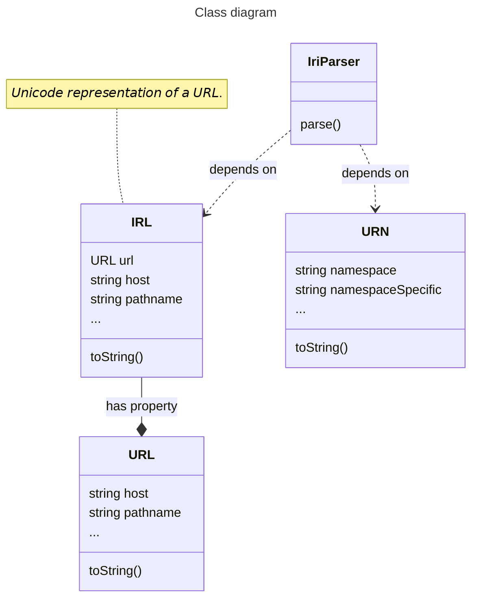

# Internationalized Resource Identifier

An [IRI](https://en.wikipedia.org/wiki/Internationalized_Resource_Identifier) parser. In addition to a parser class, this library also provides a parser for tagged templates, which is used thusly:

- const iri = IRI\`https://site.example\`;

This template parser has the same effect as `IriParser.parse()`, except that the former returns `null` in case of a parsing error, whereas the latter throws a `TypeError`.



## Usage examples

_Tip: Run the examples below by typing this in your terminal (requires [Deno](https://deno.com/) 2+):_

```shell
deno run \
  --allow-net --allow-run --allow-env --allow-read \
  jsr:@andrewbrey/mdrb@3.0.4 \
  --dax=false --mode=isolated \
  https://raw.githubusercontent.com/doga/IRI/master/README.md
```

<details data-mdrb>
<summary>Parse IRIs using the parser class.</summary>

<pre>
description = '''
Running this example is safe, it will not read or write anything to your filesystem.
'''
</pre>
</details>

```javascript
import { IriParser, URN } from 'https://esm.sh/gh/doga/IRI@2.0.0/mod.mjs';

const
iriStrings = [
  'https://çağlayan.info/user/çağlayan/?çağlayan#çağlayan',
  'urn:example:path?+resolver?=query#fragment',
  'url',
];

for (const iriString of iriStrings){
  console.info(`Parsing: ${iriString}`);
  try{
    const iri = IriParser.parse(iriString);

    if (iri instanceof URN) {
      console.info(`
        namespace         👉 ${iri.namespace}
        namespaceSpecific 👉 ${iri.namespaceSpecific}
        resolver          👉 ${iri.resolver}
        query             👉 ${iri.query}
        fragment          👉 ${iri.fragment}
      `);
    } else { // IRL (URL with Unicode characters)
      console.info(`
      IRL:
        origin   👉 ${iri.origin}
        hostname 👉 ${iri.hostname}
        host     👉 ${iri.host}
        pathname 👉 ${iri.pathname}
        hash     👉 ${iri.hash}
        search   👉 ${iri.search}

      URL:
        origin   👉 ${iri.url.origin}
        hostname 👉 ${iri.url.hostname}
        host     👉 ${iri.url.host}
        pathname 👉 ${iri.url.pathname}
        hash     👉 ${iri.url.hash}
        search   👉 ${iri.url.search}
      `);
    }
  }catch(error){
    console.error(`${error}`);
  }
}
```

Sample output for the code above:

```text
Parsing: https://çağlayan.info/user/çağlayan/?çağlayan#çağlayan

      IRL:
        origin   👉 https://çağlayan.info
        hostname 👉 çağlayan.info
        host     👉 çağlayan.info
        pathname 👉 /user/çağlayan/
        hash     👉 #çağlayan
        search   👉 ?çağlayan

      URL:
        origin   👉 https://xn--alayan-vua36b.info
        hostname 👉 xn--alayan-vua36b.info
        host     👉 xn--alayan-vua36b.info
        pathname 👉 /user/%C3%A7a%C4%9Flayan/
        hash     👉 #%C3%A7a%C4%9Flayan
        search   👉 ?%C3%A7a%C4%9Flayan

Parsing: urn:example:path?+resolver?=query#fragment

        namespace         👉 example
        namespaceSpecific 👉 path
        resolver          👉 ?+resolver
        query             👉 ?=query
        fragment          👉 #fragment

Parsing: url
TypeError: Invalid IRI: 'url'
```

<details data-mdrb>
<summary>Parse IRIs using tagged templates.</summary>

<pre>
description = '''
Running this example is safe, it will not read or write anything to your filesystem.
'''
</pre>
</details>

```javascript
import { IRI, URN } from 'https://esm.sh/gh/doga/IRI@2.0.0/mod.mjs';

const
iris = [
  IRI`https://çağlayan.info/user/çağlayan/?çağlayan#çağlayan`,
  IRI`urn:example:path?+resolver?=query#fragment`,
  IRI`url`, // === null
];

for (const iri of iris){
  if(!iri)continue;
  console.info(`IRI: ${iri}`);
  if (iri instanceof URN) {
    console.info(`
      namespace         👉 ${iri.namespace}
      namespaceSpecific 👉 ${iri.namespaceSpecific}
      resolver          👉 ${iri.resolver}
      query             👉 ${iri.query}
      fragment          👉 ${iri.fragment}
    `);
  } else { // IRL (URL with Unicode characters)
    console.info(`
    IRL:
      origin   👉 ${iri.origin}
      hostname 👉 ${iri.hostname}
      host     👉 ${iri.host}
      pathname 👉 ${iri.pathname}
      hash     👉 ${iri.hash}
      search   👉 ${iri.search}

    URL:
      origin   👉 ${iri.url.origin}
      hostname 👉 ${iri.url.hostname}
      host     👉 ${iri.url.host}
      pathname 👉 ${iri.url.pathname}
      hash     👉 ${iri.url.hash}
      search   👉 ${iri.url.search}
    `);
  }
}
```

Sample output for the code above:

```text
IRI: https://çağlayan.info/user/çağlayan/?çağlayan#çağlayan

    IRL:
      origin   👉 https://çağlayan.info
      hostname 👉 çağlayan.info
      host     👉 çağlayan.info
      pathname 👉 /user/çağlayan/
      hash     👉 #çağlayan
      search   👉 ?çağlayan

    URL:
      origin   👉 https://xn--alayan-vua36b.info
      hostname 👉 xn--alayan-vua36b.info
      host     👉 xn--alayan-vua36b.info
      pathname 👉 /user/%C3%A7a%C4%9Flayan/
      hash     👉 #%C3%A7a%C4%9Flayan
      search   👉 ?%C3%A7a%C4%9Flayan

IRI: urn:example:path?+resolver?=query#fragment

      namespace         👉 example
      namespaceSpecific 👉 path
      resolver          👉 ?+resolver
      query             👉 ?=query
      fragment          👉 #fragment
```

<details data-mdrb>
<summary>Parse some URNs that belong to well-known and less well-known namespaces.</summary>

<pre>
description = '''
Running this example is safe, it will not read or write anything to your filesystem.
'''
</pre>
</details>

```javascript
import { IriParser } from 'https://esm.sh/gh/doga/IRI@2.0.0/mod.mjs';

const
iriStrings = [
  'urn:isbn:0451450523',
  // 'urn:isan:0000-0000-2CEA-0000-1-0000-0000-Y',
  // 'urn:ISSN:0167-6423',
  'urn:ietf:rfc:2648',
  // 'urn:mpeg:mpeg7:schema:2001',
  // 'urn:oid:2.16.840',
  'urn:uuid:6e8bc430-9c3a-11d9-9669-0800200c9a66',
  // 'urn:nbn:de:bvb:19-146642',
  // 'urn:lex:eu:council:directive:2010-03-09;2010-19-UE',
  // 'urn:lsid:zoobank.org:pub:CDC8D258-8F57-41DC-B560-247E17D3DC8C',
  // 'urn:epc:class:lgtin:4012345.012345.998877',
  // 'urn:epc:id:sgtin:0614141.112345.400',
  // 'urn:epc:id:sscc:0614141.1234567890',
  // 'urn:epc:id:sgln:0614141.12345.400',
  // 'urn:epc:id:bic:CSQU3054383',
  // 'urn:epc:id:imovn:9176187',
  // 'urn:epc:id:gdti:0614141.12345.400',
  // 'urn:mrn:iala:aton:us:1234.5',
  // 'urn:mrn:iala:vts:ca:ecareg',
  // 'urn:mrn:iala:wwy:us:atl:chba:potri',
  // 'urn:mrn:iala:pub:g1143',
  // 'urn:microsoft:adfs:claimsxray',
  // 'urn:eic:10X1001A1001A450',
  'urn:rts:video:14795747', // https://www.rts.ch/play/tv/emissions
  'urn:li:share:7188778814934507520', // https://www.linkedin.com/feed/update/urn:li:share:7188778814934507520/
];

for (const iriString of iriStrings){
  try{
    const iri = IriParser.parse(iriString);
    console.info(`${iri}
      namespace         👉 ${iri.namespace}
      namespaceSpecific 👉 ${iri.namespaceSpecific}
    `);
  }catch(error){
    console.error(error);
  }
}
```

Sample output for the code above:

```text
urn:isbn:0451450523
      namespace         👉 isbn
      namespaceSpecific 👉 0451450523

urn:ietf:rfc:2648
      namespace         👉 ietf
      namespaceSpecific 👉 rfc:2648

urn:uuid:6e8bc430-9c3a-11d9-9669-0800200c9a66
      namespace         👉 uuid
      namespaceSpecific 👉 6e8bc430-9c3a-11d9-9669-0800200c9a66

urn:rts:video:14795747
      namespace         👉 rts
      namespaceSpecific 👉 video:14795747

urn:li:share:7188778814934507520
      namespace         👉 li
      namespaceSpecific 👉 share:7188778814934507520
```

∎
