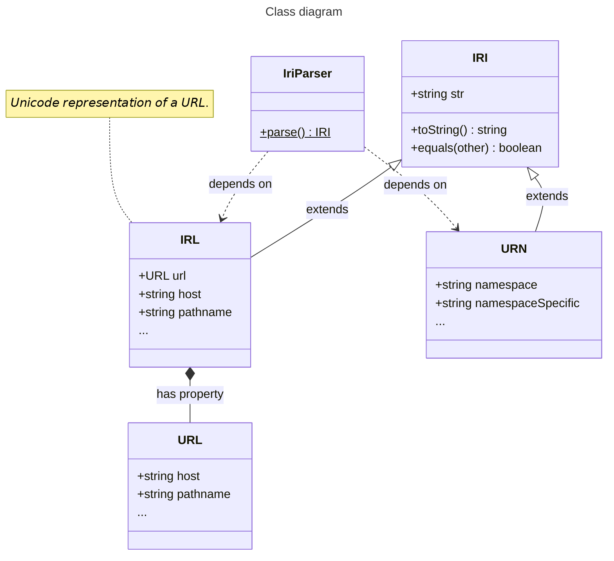

# Parser for Internationalized Resource Identifier

A parser for [IRI](https://en.wikipedia.org/wiki/Internationalized_Resource_Identifier)s.

## How this works

Parsing an `IRI` produces either an `IRL` or an `URN`. `IRL` is a non-standard representation of a `URL` that this library introduces, as it is very useful. An `IRL` object:

- keeps the URL in its original Unicode form (i.e. `https://çağlayan.info/user/çağlayan/`), without projecting the URL string into ASCII space as the URL specification requires.
- nevertheless makes the standards-compliant representation of the URL available through its `url` property (i.e. `https://xn--alayan-vua36b.info/user/%C3%A7a%C4%9Flayan/`).

This library provides a tagged template parser named `iri`, which is generally all that is needed to parse an `IRI`:

```javascript
import { iri } from 'https://esm.sh/gh/doga/IRI@3.1.6/mod.mjs';

const
host  = 'localhost',
anIri = iri`http://${host}`; // an IRL instance
```

This library provides other classes and tagged template parsers as well, as shown in the detailed usage example below.

## Usage example

<details data-mdrb>
<summary>Parse IRIs.</summary>

<pre>
description = '''
Shows how to use this library for parsing IRIs.
'''
</pre>
</details>

```javascript
import { IriParser, IRI, IRL, URN, iri, irl, url, urn } from 'https://esm.sh/gh/doga/IRI@3.1.6/mod.mjs';

const
iris = [
  iri`https://çağlayan.info/user/çağlayan/?çağlayan#çağlayan`, // IRL
  IriParser.parse('https://çağlayan.info/user/çağlayan/?çağlayan#çağlayan'), // IRL
  iri``, // null

  irl`https://çağlayan.info/user/çağlayan/`, // IRL
  irl`https://xn--alayan-vua36b.info/user/%C3%A7a%C4%9Flayan/`, // IRL
  new IRL('https://çağlayan.info/user/çağlayan/'), // IRL

  url`https://xn--alayan-vua36b.info/user/%C3%A7a%C4%9Flayan/`, // URL
  IriParser.parse('https://xn--alayan-vua36b.info/user/%C3%A7a%C4%9Flayan/'), // IRL

  urn`urn:ietf:rfc:2648`, // URN
  IriParser.parse('urn:ietf:rfc:2648'), // URN
];

for (const iri1 of iris){
  if(!iri1)continue;
  if (iri1 instanceof URN) {
    console.group(`URN: ${iri1}`);
    console.info(`
      namespace         👉 ${iri1.namespace}
      namespaceSpecific 👉 ${iri1.namespaceSpecific}
      resolver          👉 ${iri1.resolver}
      query             👉 ${iri1.query}
      fragment          👉 ${iri1.fragment}
    `);
    console.groupEnd();
  } else if (iri1 instanceof URL) {
    console.group(`URL: ${iri1}`);
    console.info(`
    URL:
      origin   👉 ${iri1.origin}
      hostname 👉 ${iri1.hostname}
      host     👉 ${iri1.host}
      pathname 👉 ${iri1.pathname}
      hash     👉 ${iri1.hash}
      search   👉 ${iri1.search}
    `);
    console.groupEnd();
  } else if (iri1 instanceof IRL) { // URL with Unicode characters
    console.group(`IRL: ${iri1}`);
    console.info(`
    IRL:
      origin   👉 ${iri1.origin}
      hostname 👉 ${iri1.hostname}
      host     👉 ${iri1.host}
      pathname 👉 ${iri1.pathname}
      hash     👉 ${iri1.hash}
      search   👉 ${iri1.search}

    URL:
      origin   👉 ${iri1.url.origin}
      hostname 👉 ${iri1.url.hostname}
      host     👉 ${iri1.url.host}
      pathname 👉 ${iri1.url.pathname}
      hash     👉 ${iri1.url.hash}
      search   👉 ${iri1.url.search}
    `);
    console.groupEnd();
  }
}
```

Sample output for the code above:

```text
step 1 of 1 // Parse IRIs using tagged templates.

IRL: https://çağlayan.info/user/çağlayan/?çağlayan#çağlayan
    
        IRL:
          origin   👉 https://çağlayan.info
          hostname 👉 çağlayan.info
          host     👉 çağlayan.info
          pathname 👉 /user/çağlayan/
          hash     👉 #çağlayan
          search   👉 ?çağlayan
    
        URL:
          origin   👉 https://xn--alayan-vua36b.info
          hostname 👉 xn--alayan-vua36b.info
          host     👉 xn--alayan-vua36b.info
          pathname 👉 /user/%C3%A7a%C4%9Flayan/
          hash     👉 #%C3%A7a%C4%9Flayan
          search   👉 ?%C3%A7a%C4%9Flayan
        
IRL: https://çağlayan.info/user/çağlayan/?çağlayan#çağlayan
    
        IRL:
          origin   👉 https://çağlayan.info
          hostname 👉 çağlayan.info
          host     👉 çağlayan.info
          pathname 👉 /user/çağlayan/
          hash     👉 #çağlayan
          search   👉 ?çağlayan
    
        URL:
          origin   👉 https://xn--alayan-vua36b.info
          hostname 👉 xn--alayan-vua36b.info
          host     👉 xn--alayan-vua36b.info
          pathname 👉 /user/%C3%A7a%C4%9Flayan/
          hash     👉 #%C3%A7a%C4%9Flayan
          search   👉 ?%C3%A7a%C4%9Flayan
        
IRL: https://çağlayan.info/user/çağlayan/
    
        IRL:
          origin   👉 https://çağlayan.info
          hostname 👉 çağlayan.info
          host     👉 çağlayan.info
          pathname 👉 /user/çağlayan/
          hash     👉 
          search   👉 
    
        URL:
          origin   👉 https://xn--alayan-vua36b.info
          hostname 👉 xn--alayan-vua36b.info
          host     👉 xn--alayan-vua36b.info
          pathname 👉 /user/%C3%A7a%C4%9Flayan/
          hash     👉 
          search   👉 
        
IRL: https://çağlayan.info/user/çağlayan/
    
        IRL:
          origin   👉 https://çağlayan.info
          hostname 👉 çağlayan.info
          host     👉 çağlayan.info
          pathname 👉 /user/çağlayan/
          hash     👉 
          search   👉 
    
        URL:
          origin   👉 https://xn--alayan-vua36b.info
          hostname 👉 xn--alayan-vua36b.info
          host     👉 xn--alayan-vua36b.info
          pathname 👉 /user/%C3%A7a%C4%9Flayan/
          hash     👉 
          search   👉 
        
IRL: https://çağlayan.info/user/çağlayan/
    
        IRL:
          origin   👉 https://çağlayan.info
          hostname 👉 çağlayan.info
          host     👉 çağlayan.info
          pathname 👉 /user/çağlayan/
          hash     👉 
          search   👉 
    
        URL:
          origin   👉 https://xn--alayan-vua36b.info
          hostname 👉 xn--alayan-vua36b.info
          host     👉 xn--alayan-vua36b.info
          pathname 👉 /user/%C3%A7a%C4%9Flayan/
          hash     👉 
          search   👉 
        
URL: https://xn--alayan-vua36b.info/user/%C3%A7a%C4%9Flayan/
    
        URL:
          origin   👉 https://xn--alayan-vua36b.info
          hostname 👉 xn--alayan-vua36b.info
          host     👉 xn--alayan-vua36b.info
          pathname 👉 /user/%C3%A7a%C4%9Flayan/
          hash     👉 
          search   👉 
        
IRL: https://çağlayan.info/user/çağlayan/
    
        IRL:
          origin   👉 https://çağlayan.info
          hostname 👉 çağlayan.info
          host     👉 çağlayan.info
          pathname 👉 /user/çağlayan/
          hash     👉 
          search   👉 
    
        URL:
          origin   👉 https://xn--alayan-vua36b.info
          hostname 👉 xn--alayan-vua36b.info
          host     👉 xn--alayan-vua36b.info
          pathname 👉 /user/%C3%A7a%C4%9Flayan/
          hash     👉 
          search   👉 
        
URN: urn:ietf:rfc:2648
    
          namespace         👉 ietf
          namespaceSpecific 👉 rfc:2648
          resolver          👉 undefined
          query             👉 undefined
          fragment          👉 undefined
        
URN: urn:ietf:rfc:2648
    
          namespace         👉 ietf
          namespaceSpecific 👉 rfc:2648
          resolver          👉 undefined
          query             👉 undefined
          fragment          👉 undefined
        
```

### Running the usage example

Run the example above by typing this in your terminal (requires [Deno](https://deno.com/) 2+):

```shell
deno run --allow-net --allow-run --allow-env --allow-read jsr:@andrewbrey/mdrb@3.0.4 --dax=false --mode=isolated 'https://raw.githubusercontent.com/doga/IRI/master/README.md'
```

## Class diagram


```mermaid
---
title: Class diagram
---

classDiagram
  class URL {
    +string host
    +string pathname
    ...
  }

  note for IRL "𝘜𝘯𝘪𝘤𝘰𝘥𝘦 𝘳𝘦𝘱𝘳𝘦𝘴𝘦𝘯𝘵𝘢𝘵𝘪𝘰𝘯 𝘰𝘧 𝘢 𝘜𝘙𝘓."
  class IRL {
    +URL url
    +string host
    +string pathname
    ...
  }
  IRL *-- URL : has property


  class URN{
    +string namespace
    +string namespaceSpecific
    ...
  }

  class IriParser {
    +parse() IRI$
  }
  IriParser ..> IRL : depends on
  IriParser ..> URN : depends on

  class IRI {
    +string str
    +toString() string
    +equals(other) boolean
  }

  IRI <|-- URN : extends
  IRI <|-- IRL : extends
```

Besides these classes, this library also provides the tagged template parsers `iri`, `irl`, `url`, and `urn`.

∎
